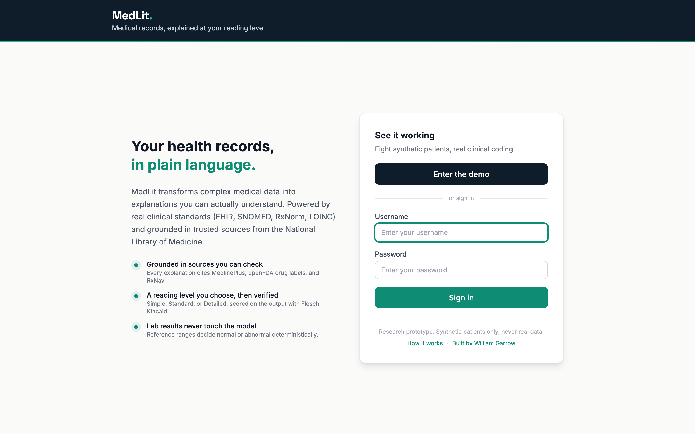
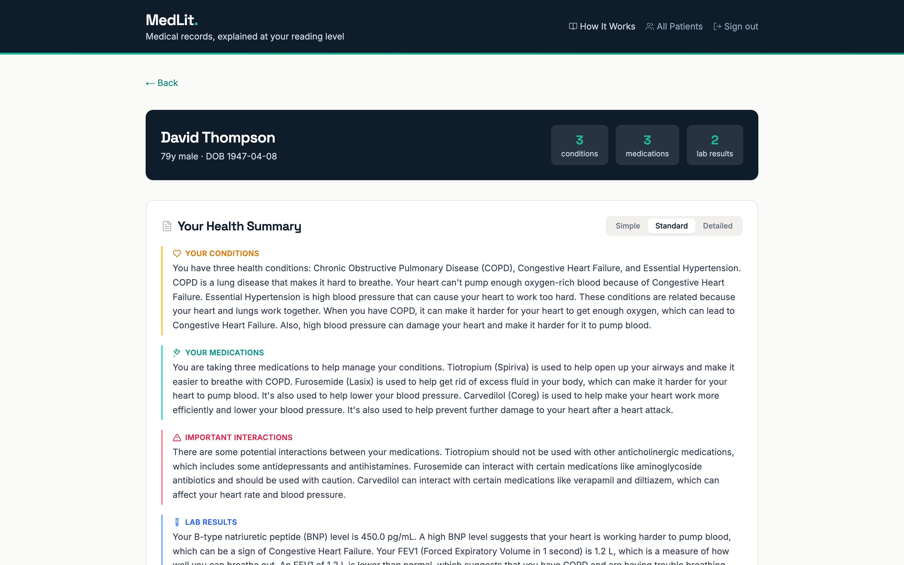
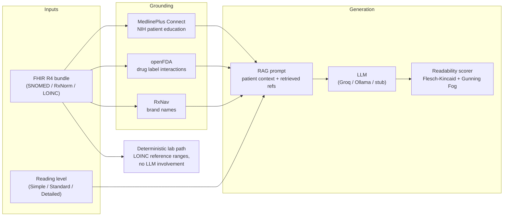

# MedLit

**Grounded, plain-language explanations of medical records, at the reading level you choose, with citations you can check.**

Live demo: https://medlit.williamgarrow.com (demo credentials on request)

MedLit ingests a patient's FHIR R4 bundle, retrieves authoritative content keyed to the patient's own clinical codes, and asks an LLM to *personalize and simplify that retrieved content* rather than generate medical claims from scratch. Every explanation cites its sources. Every lab value is interpreted deterministically, never by the model. Every output is scored for actual reading level, not assumed.

> **Research prototype.** Built with synthetic patients (Synthea). Not a medical device, not medical advice, and not for use with real patient data.





## Why this exists

Federal information-blocking rules require providers to hand patients their electronic health information, and portals satisfy the rule by handing over raw data: "Essential hypertension (disorder), SNOMED 59621000," medications by clinical name, lab values with no context. Roughly 36% of US adults have basic or below-basic health literacy. The channel that empowers patients also routinely overwhelms them.

The obvious shortcut, pasting your chart into a general-purpose chatbot, has a documented accuracy problem: in one JMIR study GPT-4 fully correctly answered only 46.7% of patient lab-interpretation questions. Generation is commodity; disciplined grounding is not.

I picked this problem for a graduate research project in early 2026 because it sat at an intersection I care about: clinical data standards, grounded language models, and whether patients actually understand what their records say. Then the industry picked it too. Epic put AI lab explanations inside MyChart. OpenAI launched ChatGPT Health with medical record connections. Anthropic, Google, Amazon, and Microsoft each shipped their own version within the same six-month window, backed by teams and budgets I could not see from my desk. None of us were copying each other. The problem was ripe, and everyone reaching for it landed on the same shape: retrieval grounded in the patient's own codes, deterministic paths where correctness matters, reading levels measured rather than assumed.

That convergence is why this repo exists in public. It is what one engineer can build of that pattern, end to end, and building it surfaced engineering problems (and one research finding) that the launch announcements do not mention.

## What is technically interesting here

**1. Grounding is keyed to the patient's own codes, not to text search.**
The FHIR bundle's SNOMED CT, RxNorm, and LOINC codes directly key retrieval from four authoritative sources: MedlinePlus Connect (NIH patient education per condition and medication), the openFDA Drug Label API (FDA-approved interaction text per medication), RxNav (brand names, so patients see "Tiotropium (Spiriva)", the name on their pill bottle), and LOINC reference ranges. The LLM is instructed to simplify and personalize the retrieved content and to avoid claims beyond it. Citations are returned with every response.

**2. Lab values never touch the LLM.**
Abnormal-versus-normal status is computed deterministically against LOINC reference ranges. A model cannot hallucinate your A1c into range because the model is not in that code path.

**3. Your synthetic data is lying to you: the code/display validator.**
During a pre-final review, an MD panelist noticed a medication card citing a MedlinePlus topic for ticagrelor (a blood thinner) under a tiotropium (COPD inhaler) label. The pipeline was correct; the RxCUI in the Synthea-generated record was wrong. The fix became `scripts/validate_fhir_data.py`: for every coded value in every bundle, call the authoritative reference and flag any display mismatch. It caught two more wrong codes (a morphine RxCUI that maps to remifentanil, an oxybutynin RxCUI that maps to torsemide) plus several deprecated codes. It now runs as a network-marked pytest guard. If you join coded clinical data to external knowledge, validate code/display consistency at ingest. Do not trust synthetic data to be internally coherent.

**4. The reading-level floor effect.**
Output is post-scored with Flesch-Kincaid and Gunning Fog, so the UI shows the realized reading level instead of trusting the prompt. Across evaluation runs (three patients, three levels), FK grade rose monotonically with the requested level, 7.7 (Simple) to 8.1 (Standard) to 9.4 (Detailed), but even at Simple the output floors near grade 7.7 despite a 5th-6th grade target. This independently replicates Will et al. (2025, JMIR), who found LLM-rewritten patient materials settle near grade 7.6 under a fifth-grade instruction. Lifting that floor is an open research question this codebase is instrumented to explore.

## Architecture



Stack: FastAPI + Python 3.12 backend, Next.js 14 + Tailwind frontend, nginx, Docker Compose, Let's Encrypt. LLM providers: Groq (demo), Ollama (local), stub (no key needed).

## Quickstart

```bash
git clone https://github.com/WilliamGarrow/medlit.git
cd medlit
cp .env.example .env        # defaults to the keyless stub provider
docker compose build && docker compose up -d
open http://localhost
```

Works with zero API keys out of the box (`LLM_PROVIDER=stub` returns template responses). For real explanations set `LLM_PROVIDER=groq` plus `GROQ_API_KEY`, or `LLM_PROVIDER=ollama` with a local model.

### Configuration

| Variable | Default | Purpose |
|----------|---------|---------|
| `LLM_PROVIDER` | `stub` | `groq`, `ollama`, or `stub` |
| `GROQ_API_KEY` | empty | Required for the Groq provider |
| `OLLAMA_BASE_URL` / `OLLAMA_MODEL` | `http://ollama:11434` / `llama3.1:8b` | Local inference |
| `AUTH_DISABLED` | `true` | Disable login for local dev |
| `SESSION_SECRET` | dev value | Set a random value in production (`openssl rand -hex 32`) |
| `ADMIN_PASSWORD` / `DEMO_PASSWORD` | `changeme-*` | Login credentials when auth is enabled |
| `FHIR_DATA_PATH` | `/app/data/fhir` | Patient bundle directory |

### Validate the FHIR data

```bash
cd backend
pytest -m network tests/test_fhir_data_validation.py   # hits live RxNav/MedlinePlus/LOINC
python ../scripts/validate_fhir_data.py                # standalone report
```

## Evaluation

`scripts/evaluate.py` generates summaries across patients, reading levels, and LLM providers, and scores each output. Results land in `evaluation/`. Current headline numbers (Llama-3.1-8B, 9 generations):

| Requested level | Target grade | Realized FK grade (avg) |
|-----------------|--------------|-------------------------|
| Simple | 5th-6th | 7.7 |
| Standard | 7th-8th | 8.1 |
| Detailed | 10th-12th | 9.4 |

Monotonic, in the right direction, and floored well above the Simple target. See "reading-level floor effect" above.

## Project status and roadmap

Built as a Georgia Tech graduate research project; a paper on the grounding pipeline and the readability floor is in preparation. Active roadmap:

- Extract the code/display validator into a standalone package for any FHIR pipeline
- Extract the readability/grounding scorer into a CI-style eval harness for patient-facing LLM features
- Screenshots and a hosted demo walkthrough
- Comprehension-focused evaluation beyond readability formulas

## References

- Kutner et al. (2006). *The Health Literacy of America's Adults* (NCES 2006-483)
- ONC (2020). 21st Century Cures Act information blocking final rule
- Will et al. (2025). Enhancing readability of patient education materials with LLMs. *JMIR* 27:e69955
- Walonoski et al. (2018). Synthea: synthetic patient generation. *JAMIA* 25(3)

## License

Apache 2.0. See [LICENSE](LICENSE).

Built by [William Garrow](https://williamgarrow.com) ([LinkedIn](https://www.linkedin.com/in/williamgarrow/)).
